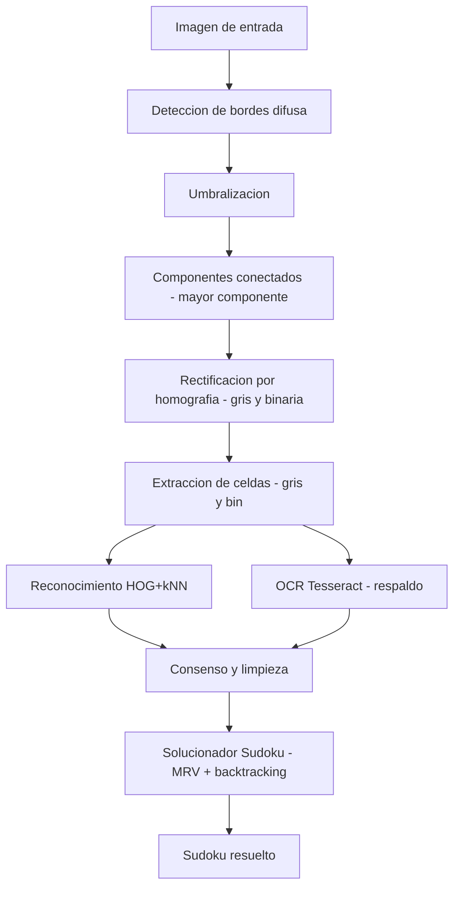

## Reconocimiento y Resolución de Sudokus mediante Lógica Difusa (IEEE-Style)

### Abstract - Resumen
Este proyecto implementa un pipeline completo para el reconocimiento y la resolución automática de sudokus a partir de una imagen de entrada. El enfoque principal es el uso de lógica difusa (Mamdani) para el soporte del procesamiento de imagen (detección de bordes) previo a la rectificación, segmentación y lectura de dígitos. El sistema integra: detección de bordes difusa, umbralización, componentes conectados, rectificación por homografía, extracción de celdas, reconocimiento de dígitos (HOG+kNN con respaldo OCR/Tesseract) y un solucionador por backtracking (MRV). Actualmente, el resultado final depende de un “objeto demo” (rejilla conocida) que se usa como respaldo para garantizar que el módulo de resolución funciona correctamente, dado que el reconocimiento de dígitos y el OCR de respaldo aún no alcanzan una exactitud suficiente de forma consistente.

Palabras clave: Sudoku, Lógica Difusa, Mamdani, Procesamiento de Imágenes, Detección de Bordes, Homografía, Segmentación, OCR, Tesseract, OpenCV, HOG, k-NN, Backtracking, MRV.

### I. Introducción
El reconocimiento robusto de sudokus en imágenes del mundo real implica lidiar con variaciones de iluminación, perspectiva, ruido y grosores de líneas. Este proyecto explora un pipeline donde la detección de bordes se apoya en un sistema difuso Mamdani para mejorar la calidad del mapa de bordes antes de la binarización y extracción de la rejilla. A partir de la imagen rectificada, se segmentan celdas y se reconocen dígitos combinando un clasificador HOG+kNN con OCR de respaldo. Posteriormente, un solucionador por backtracking resuelve la cuadrícula resultante.

### II. Visión General del Sistema
Entrada: imagen del sudoku (.jpg o .png). Salida: sudoku resuelto (impreso en consola; archivos intermedios opcionales en modo verbose).

Pipeline general:

```
Imagen -> Bordes (difuso) -> Umbralización -> Mayor Componente ->
Rectificación (gris + binaria) -> Extracción de celdas ->
Reconocimiento de dígitos (HOG+kNN + OCR) -> Limpieza/Consenso -> Solver -> Solución
```

Diagrama de flujo (Mermaid):



Notas:
- Con VERBOSE=False, los intermedios se generan en temporales y se descartan. Con VERBOSE=True, se guardan en el directorio de trabajo.
- Si el solver no logra resolver con la cuadrícula reconocida, se prueban alternativas (solo KNN limpio, solo OCR limpio) y, si todo falla con `f2`, se usa un puzzle conocido como demo para evidenciar el módulo de resolución.

### III. Metodología (resumen)
1) Lógica difusa (Mamdani) para bordes: variables Ix/Iy/Iout, LUT de centroides. (utilities.py, tinyfuzzy.py)
2) Umbralización binaria del mapa de bordes. (thresholding.py)
3) Componentes conectados (8-conexo) y mayor componente. (connected_components.py)
4) Rectificación por homografía (DLT simplificado + warp bilineal). (rectify.py)
5) Extracción de celdas con padding y espejo binario. (cell_extraction.py)
6) Reconocimiento de dígitos: HOG+kNN (dataset OpenCV o sintético) + OCR Tesseract. (digit_classifier.py, ocr.py)
7) Consenso y limpieza de conflictos; Solver MRV+backtracking. (sudoku_solver.py)

### IV. Estructura del Proyecto
- main.py: orquesta el pipeline; verbose, temporales, consenso, fallback y solución.
- utilities.py: utilidades y FuzzyEdgeDetector (config, LUT, convoluciones, pipeline difuso).
- tinyfuzzy.py: MFs, Mamdani, Sugeno, centroide, FCM (NumPy puro).
- thresholding.py: umbralización con progreso.
- connected_components.py: BFS 8-conexo y mayor componente.
- rectify.py: esquinas, H (DLT), warp bilineal.
- cell_extraction.py: división regular en celdas, padding, espejo binario.
- digit_classifier.py: HOG+kNN, generación de dataset, variantes para consenso.
- ocr.py: OCR con Tesseract (preprocesado para celdas pequeñas).
- sudoku_solver.py: Solver MRV+backtracking con logs opcionales.

### V. Limitaciones
- Reconocimiento de dígitos (KNN/OCR) no alcanza aún exactitud suficiente de forma consistente.
- Respaldo “demo” para `f2` asegura demostrar el funcionamiento del solver cuando el reconocimiento falla.
- Consolas Windows: se implementó un fallback ASCII en logs para evitar errores Unicode.

### VI. Uso
Requisitos: numpy, Pillow, tqdm, rich, opencv-python, pytesseract; Tesseract instalado (en Windows configurar `tesseract_cmd` si es necesario).

```
python main.py
```
Parámetros en `main.py`: `FILE_NAME`, `VERBOSE`.

### VII. Créditos y Licencia
Autor: Kevin Esguerra Cardona — kevin.esguerra@utp.edu.co

Desarrollado con ayuda del modelo Codex de OpenAI (Codex CLI).

Licencia: MIT (ver archivo LICENSE).

